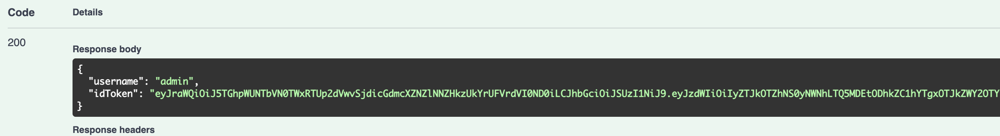
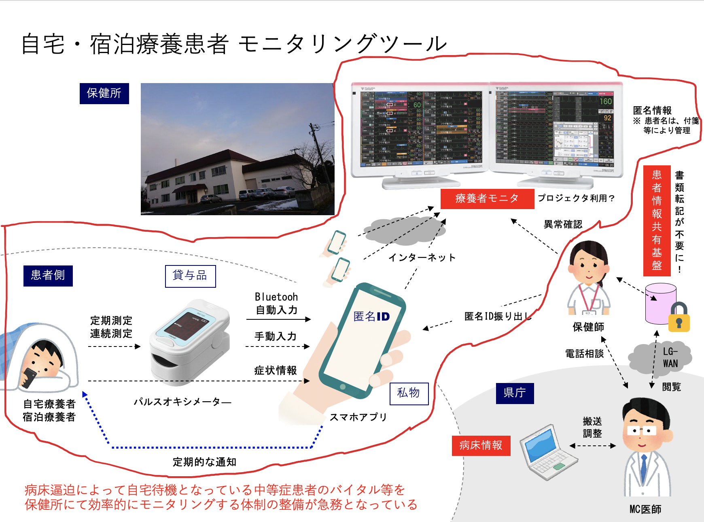

# 遠隔患者モニタリングシステム

## これは何？

自宅療養や宿泊療養中の患者にスマートフォン上で必要項目を入力してもらい、患者の健康状態の把握を保健所で行いやすくするためのシステムです。

背景情報については、[BACKGROUND.md](docs/BACKGROUND.md)もご覧ください。

## 手伝ってくださる方へ

本システムは現状無報酬での開発となっており、コントリビューターを募集しております。

Issues に手伝って欲しいタスクを記載していますのでご確認ください。
お手伝いいただける方は、必ず[CONTRIBUTING.md](docs/CONTRIBUTING.md)をご一読いただけますようよろしくおねがいします。

また、ボランティアベースで本番環境の運用を行うことは難しいため、ある程度まで開発が進んだ段階からは、運営能力のある法人が自治体等からの委託事業としてシステムの保守/運用を行う事を想定していますのでご了承ください。

## Swagger UI

[Swagger UI](https://codeforjapan.github.io/remote-patient-monitoring-api/) からステージング用のAPIを実行することができます。

まず、`/api/admin/login` から、指示された User/Password を使ってログインを行ってください。
成功すると、`idToken` が返却されます。

ここで返却された `idToken` の値を、`Authorize` ボタンを押した先にあるWindowの `APIGatewayAdminAuthorizer  (apiKey)` にセットすることで、APIをテストすることができます。

同様に、`/api/admin/centers/{centerId}/nurses/` などで作成した `Nurse` や　`/api/admin/centers/{centerId}/patients/` で作成した `Patient` で Login 系のメソッドを叩くと帰ってくる `idToken` を使えば、別の Authorizer でログインセッションを貼ることができます。

## 開発環境について

[DEVELOPMENT.md](docs/DEVELOPMENT.md)をご確認ください。

## システム概要

※本システムは赤字で囲んだ部分が対象

詳細については、[システム仕様](docs/SPECIFICATION.md)をご覧ください。

本リポジトリは、全体的なIssue管理及び、API サーバの開発のためのリポジトリとなります。

保健師用ダッシュボード については、[remote-patient-monitoring-dashboard](https://github.com/codeforjapan/remote-patient-monitoring-dashboard)を、
患者用クライアント については、[remote-patient-monitoring-client](https://github.com/codeforjapan/remote-patient-monitoring-client)をご覧ください。

## これまでの歩み

| 日付       | 内容                                                                                 |
| ---------- | ------------------------------------------------------------------------------------ |
| 2021/04/30 | 一旦の実装が完了し、北海道の保健所でテスト実施。概ね高評価を得る。今後に向けての調整中         |
| 2021/01/30 | サーバのステージング用URLを作成。（APIの機能自体はまだ全ては終わっていない）         |
| 2020/12/30 | ユースケース及びワイヤーフレームが8割方完成。開発に着手。リポジトリを3つに分ける     |
| 2020/12/26 | 本リポジトリを作成                                                                   |
| 2020/12/23 | 奥村先生とボランティアチームのミーティングを実施、ざっくりとしたシステム要件が固まる |
| 2020/12/14 | 奥村先生の呼びかけに応じ、調査を開始                                                 |

## ライセンス

MIT ライセンスです。

## CONTRIBUTORS

[docs/CONTRIBUTORS.md](docs/CONTRIBUTORS.md)をご確認ください。
