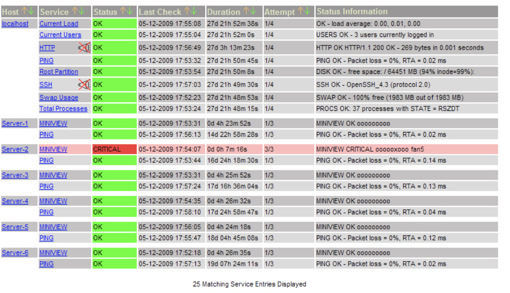
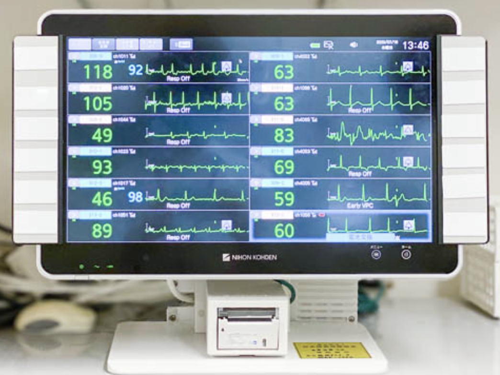

# システム仕様

背景情報については、[BACKGROUND.md](BACKGROUND.md)もご覧ください。
## 患者側システム

* Web もしくは アプリ にて、患者が必要な情報を入力してサーバに送信する
* スマートフォンは、患者が自身のものを利用する
* 何らかの方法で、保健所から渡された匿名IDをセットする必要がある（いたずらを防ぐためのパスワードも必要？）
* 定期的に、パルスオキシメーターで取得した情報や体温、症状などの情報を入力する
  * パルスオキシメーターでは、酸素飽和度及び脈拍が取得可能
  * [ ] 症状については必要な情報を確認中
* リスクの高い患者については、Bluetooth 対応のパルスオキシメーターとスマートフォンを渡し、自動でデータを吸い上げることを検討する

## 保健所側システム

* 保健所ごとに、担当する患者の状態一覧が見れる
  * 患者に対して、匿名のIDをっ発行する機能が必要と思われる(療養を申し渡したタイミングでの発行を想定)
  * 患者の匿名IDに対して、ニックネームを付けられるようにする（個人情報ではない想定）
* 患者の数は、1保健所100名を超える可能性があるため、スクロールして表示する
* 以下のような場合にアラートを上げる
  * バイタル情報が規定のレンジに収まっているか？
  * データが途切れていないか？
* バイタルが特定のしきい値を越えたら文字の色を変える
* 体温については、グラフ表示をしたい

## 参考

サーバ管理ツールの画面

セントラルモニタのイメージ（この画面は患者が固定されているが、今回は1画面には収まらないのでスクロール表示を検討）

